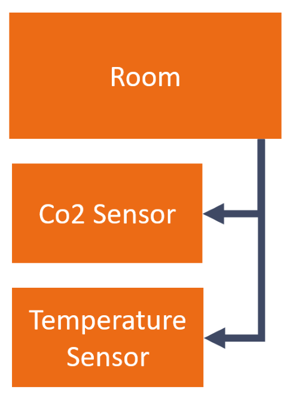
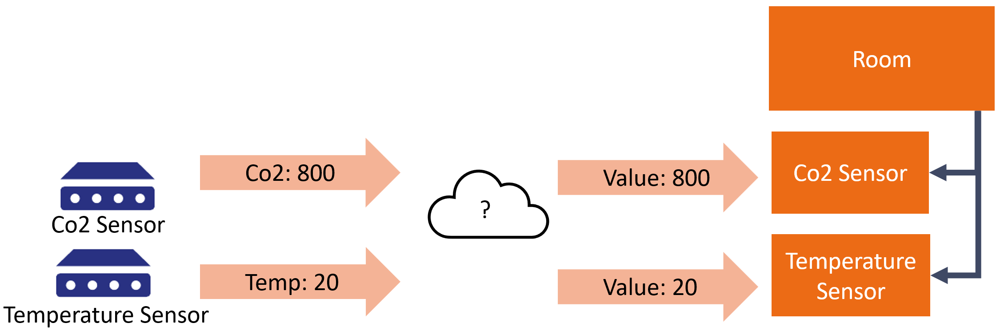
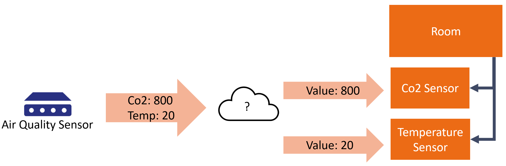
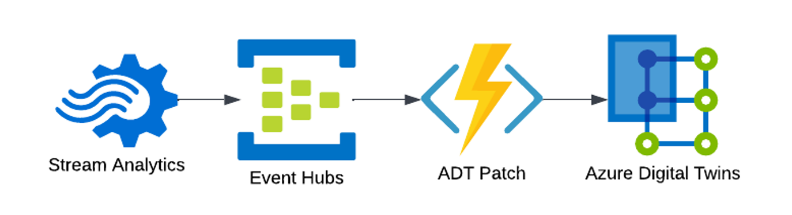
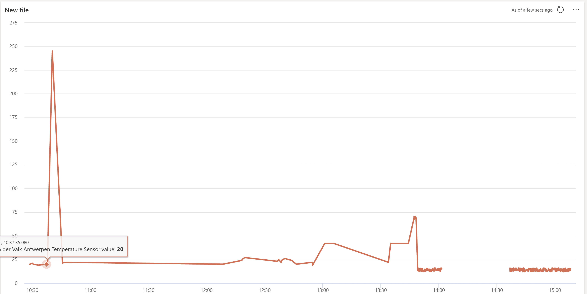

A digital twin of a building, a single point of truth for anything happening in our workspace, in real-time! We plan to use Azure Digital Twins to create a complete overview of our office. While we have the skills and experience to get started right away, we took some time on our innovation day to tackle a few challenges to make our platform into something you won't find anywhere else. When we took a quick inventory of all the things we would like to model in our digital twin, we needed a way to translate any message into any twin update in a dynamic way. Otherwise, you would need to write separate code for:
- Rooms
- Phone booths
- Car chargers
- Our Farmbot
- The beer fridge (obviously)

This post describes what we came up with after one day. It tackles some of the most common issues we've run into when building twins with ADT.

## Mapping device telemetry to a twin
There are many ways to map device telemtry to a twin in Azure digital twins, let's take this example of the twins of a room with two sensor types attached to it:


In this example, you will have one room, with two different sensors attached to it. This is great when you have two different sensors/devices reporting telemetry seperately. See the below sample:


The cloud icon represents a solution that maps a single incoming message, to a single twin. This is very straightforward to achieve. It's also the scenario that most tutorials describe. But what if a single message should lead to multiple updates? See the example below:


Now we have a device that can report both temperature and Co2 values, we need to split those values up to update multiple twins. This is no big deal, but what we wanted to achieve was to make a single solution that could support both scenarios. We wanted to be able to turn one message into a single twin update, or multiple, without having to write code for every new device we would want to onboard in the future.

We use Azure Stream Analytics to match incoming device messages and map them against a reference file to achieve this. An incoming message is joined by its device ID to the reference file, which holds a structure similar to this:
|deviceId|property|twinId|twinPath|
|---|---|---|---|
|co2sensor|body.data.co2|room1-co2|/lastValue|
|temperaturesensor|body.data.temperature|room1-temperature|/lastValue|
|airqualitysensor|body.data.temperature|room2-co2|/lastValue|
|airqualitysensor|body.data.co2|room2-temperature|/lastValue|

The query we then run over the incoming data is as follows, we added bit of optimisation to it in the form of a tumbling window to group changes together.
```sql
with transformed as
(
    select 
        iotHub.EventEnqueuedUtcTime as receivedAt,
        GetRecordPropertyValue (iotHub, referenceData.property) as value,
        referenceData.type as valueType,
        referenceData.twinPath as path,
        referenceData.twinId as twinId
    from iotHub
    join referenceData on iotHub.IoTHub.ConnectionDeviceId = referenceData.deviceId
)

select
    transformed.twinId,
    collect(transformed) AS changes
into patches
from transformed
group by transformed.twinId, TumblingWindow(second, 5) 
```

The output of this query is a twinId and all the changes (patches) that need to be done to update that twin. This brings us to our second mission of the day.

## Centralising the Azure Digital Twins updates
There are service limits for Azure Digital Twins, the one we're especially interested in is the [API rate limit][1]. You can do up to 1000 patch requests per second, before ADT will politely ask you to back off. You might not think you'll reach that limit, but on a particulary busy day, with a very detailed connected building definition, it might just happen. If you have multiple applications writing to ADT, it will become challenging to deal with this limit when you do hit it. For that reason, we centralised writing updates to ADT. We decided to write a single Azure Function that listens to the Event Hub that the above Stream Analytics Job is using as an output.


There are some other benefits to this approach. To rebuild your twin, you can restart this Function to replay events starting from a couple of days ago (depending on your retention settings). Or you could simply stop the Azure Function if you wanted to take a snapshot of your ADT graph. Those topics deserve their own blog post (and possibly their own innovation day).

## Storing historical data
Azure Digital Twins doesn't deal with historical values. We're sorry if you landed on this blog post searching for "Azure Digital Twins Historical Data"! Luckily, there are powerful tools to gain insight into historical data. Time Series Insights used to visualise time series data from ADT for a while now, but we wanted to explore a different option. Now that we had a function Azure Digital Twin, receiving updates regularly, we wanted to explore the option of using Azure Data Explorer to get some more insights in what was happening.

The results were good, and we will keep exploring using the [Data Explorer Plugin][9] for ADT in the future. As for now, you can find the story of our entire innovation day in this one graph:



> All of this wouldn't have been possible without [Kees Verhaar][2], [Sander Trijssenaar][4], [Tijmen van de Kamp][5], [Arjan van Bekkum][6], [Rutger Buiteman][7] and [Bas van de Sande][3]. Bas also made an [excellent writeup][8] of his journey with .Net NanoFramework and ESP32 development. Special thanks to [Olena Borzenko][10] for sanity-checking everything we built!

[1]: https://docs.microsoft.com/en-us/azure/digital-twins/reference-service-limits?WT.mc_id=IoT-MVP-5004034#rate-limits
[2]: https://xpirit.com/team/kees-verhaar/
[3]: https://xpirit.com/team/bas-van-de-sande/
[4]: https://xpirit.com/team/strijssenaar/
[5]: https://xpirit.com/team/tijmen/
[6]: https://xpirit.com/team/arjan-van-bekkum/
[7]: https://xpirit.com/team/rutger-buiteman/
[8]: https://azurecodingarchitect.com/posts/prepare-for-iot/
[9]: https://docs.microsoft.com/en-us/azure/digital-twins/concepts-data-explorer-plugin?WT.mc_id=IoT-MVP-5004034
[10]: https://xpirit.com/team/olena-borzenko/