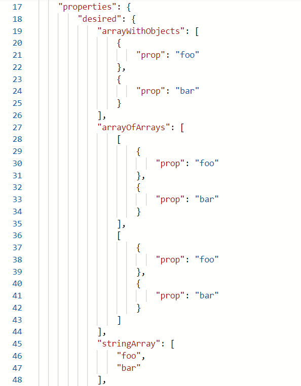

Azure IoT Hub supports the inclusion of arrays in Device Twins since around September last year. This is a very helpful feature, especially if your device twin contains complex configurations. At the time of writing, it's a relatively new feature, so there aren't a lot of up-to-date sources to refer to. In this post I'll show how you can use the REST API to add arrays to your device twin, and the C# device SDK to use them on a device.

## Prerequisites
In order to use the REST API, we will need the IoT Hub Name, the device ID of the device you want to update, and an authorization token. With that, we can start making PATCH requests to the following URL:
`https://<iot-hub-name>.azure-devices.net/twins/<device-id>?api-version=2020-05-31-preview`

You can replace `<iot-hub-name>` with your IoT Hub, and replace `<device-id>` with your device ID. As for the Shared Access Signature. The easiest way to do this is by using the Az CLI command:

`az iot hub generate-sas-token -n <iot-hub-name>`

You can copy the value of `sas`, and add that as an `Authorization` header to your request. With that in place, we can send PATCH messages to the URL mentioned above, let's get started!

## An array of strings
Let's start simple, and use an array of strings. For the body of our message, we can use the following:
```json
{
   "properties":{
      "desired":{
         "stringArray":[
            "foo",
            "bar"
         ]
      }
   }
}
```
This action should return a HTTP status 200, but if you want to confirm that it worked, check the portal, or do a GET request to the same URL.

## Array of objects
A common use case with arrays is to have an array with objects. Your device twin won't mind, so let's give that a try:
```json
{
   "properties":{
      "desired":{
         "arrayWithObjects":[
            {
               "prop":"foo"
            },
            {
               "prop":"bar"
            }
         ]
      }
   }
}
```

## Getting silly: an array of arrays
Well, you came here for arrays. So let's put some arrays in your array!
```json
{
   "properties":{
      "desired":{
         "arrayOfArrays":[
            [
               {
                  "prop":"foo"
               },
               {
                  "prop":"bar"
               }
            ],
            [
               {
                  "prop":"foo"
               },
               {
                  "prop":"bar"
               }
            ]
         ]
      }
   }
}
```

## Checking the result in the portal
You can check the results in the Azure Portal by going to your IoT Hub, navigating to Devices -> your device -> Device Twin



## Getting the twin as a device
To work with the arrays on the device side, you'll need to retrieve the device twin and transform the data into the required type. I made a very small PoC that shows how to cast the properties to a `JArray` and then turn it into the corresponding C# type. To replicate the example, add the `Microsoft.Azure.Devices.Client` NuGet package to your project and provide your own device connection string.

```cs
class Program
{
    static async Task Main(string[] args)
    {
        var deviceClient = DeviceClient.CreateFromConnectionString("<device-connection-string");
        var twin = await deviceClient.GetTwinAsync();

        Console.WriteLine("Array of strings:");
        var jArray = twin.Properties.Desired["stringArray"] as JArray;
        var strings = jArray.Values<string>().ToArray();
        foreach (var line in strings)
        {
            Console.WriteLine(line);
        }

        Console.WriteLine("Array of objects:");
        var jArrayOfObjects = twin.Properties.Desired["arrayWithObjects"] as JArray;
        var arrayOfObjects = jArrayOfObjects.ToObject<MyObject[]>();
        foreach (var myObject in arrayOfObjects)
        {
            Console.WriteLine(myObject.Property);
        }

        Console.WriteLine("Array of arrays:");
        var jArrayOfArrays = twin.Properties.Desired["arrayOfArrays"] as JArray;
        var arrayOfArrays = jArrayOfArrays.ToObject<MyObject[][]>();
        foreach (var arrayOfArray in arrayOfArrays)
        {
            foreach (var myObject in arrayOfArray)
            {
                Console.WriteLine(myObject.Property);
            }
        }
    }
}

internal sealed class MyObject
{
    [JsonProperty("prop")]
    public string Property { get; set; }
}
```

## Additional information
Arrays add more flexibility to the way you can pass configurations to your devices, but do remember there is a 32 KB limit to both your desired and reported properties collection. You can find more information on Device Twins [on this page][1]
You can find the REST API documentation [here][2]. 

  [1]: https://docs.microsoft.com/en-us/azure/iot-hub/iot-hub-devguide-device-twins?WT.mc_id=IoT-MVP-5004034#device-twin-size
  [2]: https://docs.microsoft.com/en-us/rest/api/iothub/service/devices/update-twin?WT.mc_id=IoT-MVP-5004034