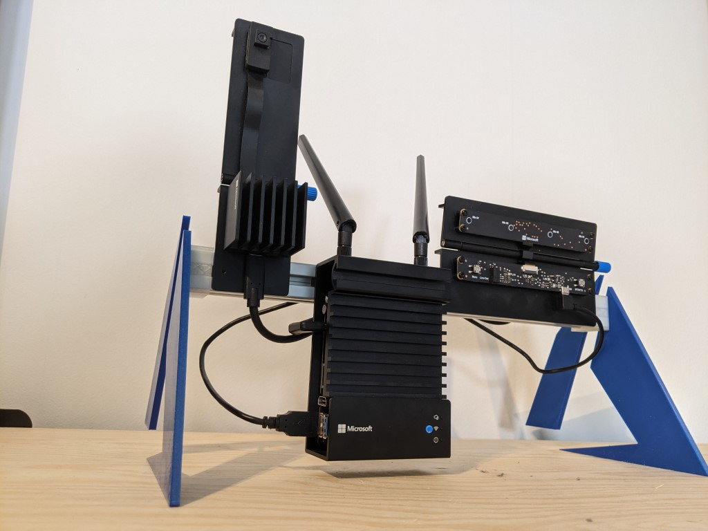
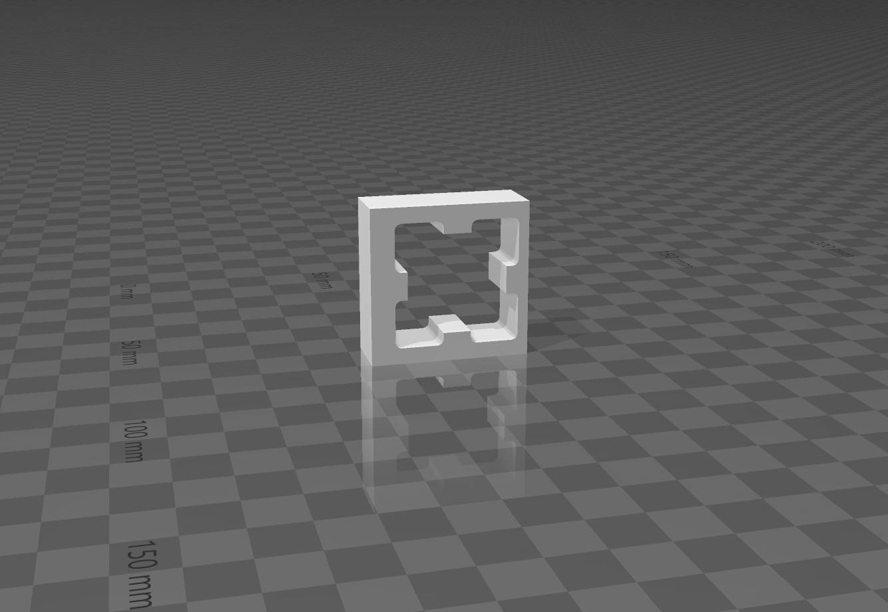
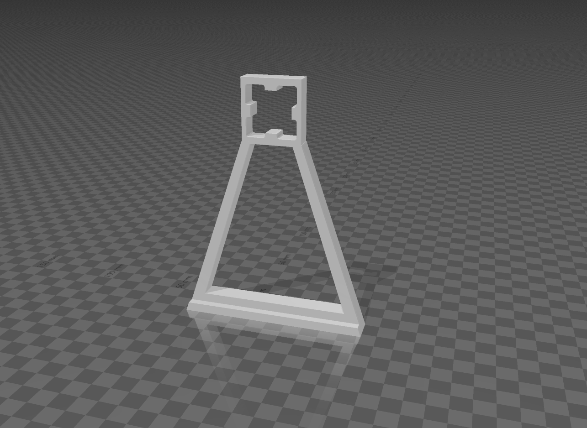
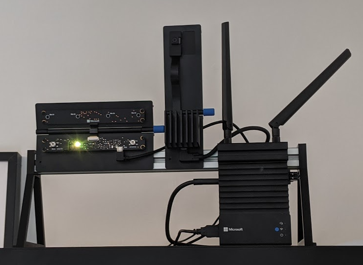
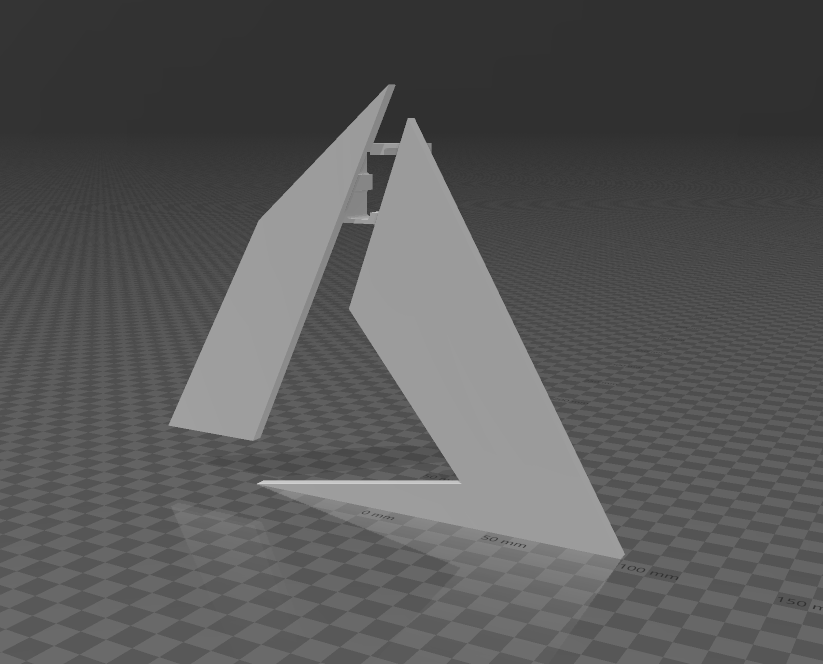
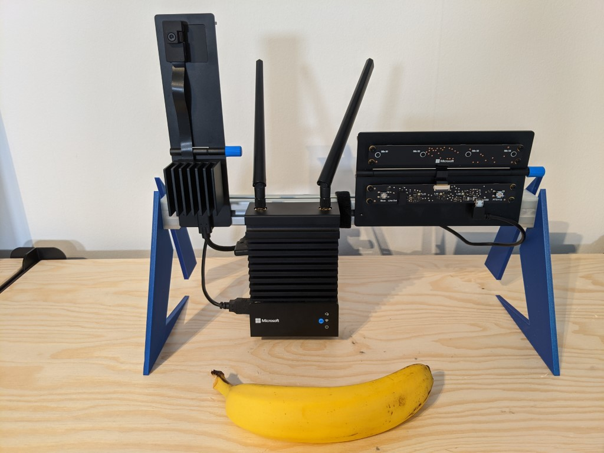
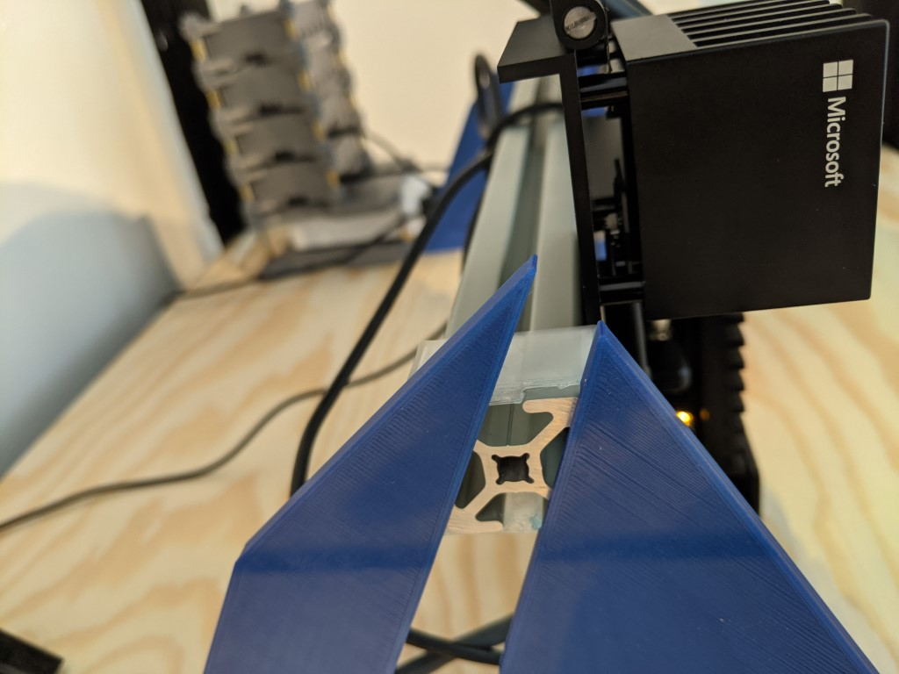

**TL;DR: I made a thing and you can get it [here][4]**

The Azure Percept DK is a great device to build your AI at the edge prototypes with. It comes mounted on a piece of 8020 rail, which is a global standard for all kinds of setups. But unfortunately, my home office doesn't feature any other pieces of 8020, so I couldn't mount it anywhere. This isn't too much of a problem, but it makes it hard to properly orient the camera at times. And as if I need to justify this project anymore: how will people know I'm using this awesome tech if I can't showcase it in my home office! When you have a 3D printer, you get to solve all kinds of problems that don't exist...

This is what I did:

## Quick Search Of Thingiverse
I searched Thingiverse for Azure Percept, and nothing popped up. Hey, I tried! 

Next, I tried finding some 8020-related models to see if there was any model I could remix. My 3D skills are extremely limited, so I needed a good starting point. I found [this model][1], and it turned out to be a great fit! Full credit of this part to user [menerso][2]. I used Tinkercad to trim it to just this part:

## My Limited 3D Skills
The first version I made was a very simple triangular shape (did I mention my 3D skills are limited?)

The result wasn't bad, it just wasn't... flashy enough?

## How To Not Model An Azure Logo
This design needed 100% more Azure, so I set off to design the Azure logo in 3D before quickly realising I have no 3D skills whatsoever. Luckily, my trusty tool Tinkercad allows importing of SVG files! So I imported the Azure logo and for some reason it was only at that point that I realised that the Azure logo exists of two separate parts... So after some tinkering I decided to use the 8020 rail connector to connect the two, and just print the model in two colours through a filament swap.

I'm really please with this blue filament I picked up, it doesn't match the Azure logo's colour, but it prints great and is quite glossy too. It has an almost mirror-like finish when you print it on a glass bed. It's [Fillamentum Noble Blue][3], if you want to get the same. So here it is, the end result:

[1]: https://www.thingiverse.com/thing:867919
[2]: https://www.thingiverse.com/menerso/designs
[3]: https://shop.fillamentum.com/products/pla-extrafill-nobble-blue
[4]: https://www.thingiverse.com/thing:4828993