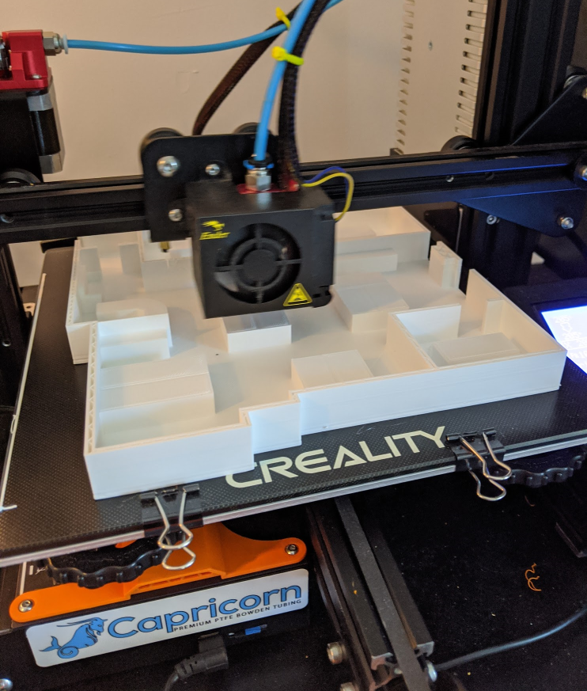

Truth be told, this entire blog post series was inspired by my browsing of Thingiverse, looking to print something interesting. Somehow I stumbled onto a [3D model][1] of one of my favourite shows: The Office. It even included a floor plan! As I'm typing this blog post, I'm printing the "interesting half" of the Office, leaving out the restrooms and... Toby, which is fine. It occurred to me that Dunder Mifflin would also need a way to deal with the pandemic and how to use their office space. So I started to design a reservation system for my favourite company, built on top of Azure Digital Twins (ADT). This is in no way a tutorial, it's more of a journal where I discover the features of ADT.



# Getting Started
What I want to achieve, is a system that allows employees to reserve a desk for an amount of time. This is something that many companies are looking at, and I will build it on Azure Digital Twins (ADT). The [documentation][2] for ADT is very complete, and you should give it a try. The "end-to-end" tutorial is something you want to do manually just once, the [official GitHub repo][3] has a deployment script that completely automates the process, so you can start with designing your models right away.

# Modeling our entities
Designing models is one of the most important steps when building anything on top of ADT, it will decide how you are representing the physical environment and how it interacts with digital processes (such as our reservation system). Models are described using the Digital Twin Definition Language (DTDL). I'm going to start simple might revise this later, the models I have in mind are:
- Floor
- Area
- Desk
- Reservation
- Employee

For a normal office I would probably model the concept of a "meeting room", but the Dundler Mifflin office in Scranton only has one meeting room, so I'll regard that as a desk*

## Floor
I'm only covering one floor, but it's still nice to have an entity in our system that other entities can connect to. Otherwise, the models on this floor would be floating around. I'm adding no properties to it right now, just a relationship to the next model.
``` json
{
    "@context": "dtmi:dtdl:context;2",
    "@id": "dtmi:dundermifflin:Floor;1",
    "@type": "Interface",
    "contents": [
        {
            "@type": "Relationship",
            "name": "contains",
            "target": "dtmi:dundermifflin:Area;1"
        }
    ]
}
```

## Area
I could leave this out, and have the desks relate directly to the floor, but I think Michael would appreciate if there was an Area called "Michael's office", and I'm all about user adoption! I refuse to let him name the internal ID ($dtId) of the entity, so I'm adding a property for a display name. I find that many models that contain data that are potentially shown to humans can benefit from a display name. I *could* make the display name property in a component, so I can reuse it. But I don't think I'll benefit from a component with just one property.
``` json
{
    "@context": "dtmi:dtdl:context;2",
    "@id": "dtmi:dundermifflin:Area;1",
    "@type": "Interface",
    "contents": [
        {
            "@type": "Property",
            "name": "displayName",
            "schema": "string"
        },
        {
            "@type": "Relationship",
            "name": "contains",
            "target": "dtmi:dundermifflin:Desk;1"
        }
    ]
}
```

## Desk
For the desks, I added an identifier. I see this happening at Avanade's office as well, it's just an identifier that the reservation system can use when you want to reserve a desk. But for nostalgia's sake, I'm adding a display name again. That way if *somebody* wanted Dwight's desk to have a different name, that would be an easy change!

``` json
{
    "@context": "dtmi:dtdl:context;2",
    "@id": "dtmi:dundermifflin:Desk;1",
    "@type": "Interface",
    "contents": [
        {
            "@type": "Property",
            "name": "displayName",
            "schema": "string"
        },
        {
            "@type": "Property",
            "name": "identifier",
            "schema": "string"
        },
        {
            "@type": "Property",
            "name": "status",
            "schema": {
                "@type": "Enum",
                "valueSchema": "integer",
                "enumValues": [
                    {
                        "name": "available",
                        "displayName": "Available for reservation",
                        "enumValue": 0
                    },
                    {
                        "name": "reserved",
                        "displayName": "Reserved",
                        "enumValue": 1
                    },
                    {
                        "name": "needsCleaning",
                        "displayName": "Needs cleaning",
                        "enumValue": 2
                    }
                ]
            }
        },
        {
            "@type": "Relationship",
            "name": "has",
            "target": "dtmi:dundermifflin:Reservation;1"
        }
    ]
}
```

On a more serious note, this is where one of the more powerful features of ADT comes into play. I added a property with an Enum schema. This way, the value of this property is limited to the values I describe in the model. For this Enum schema, I'm choosing a value type of integer. To be honest, a string type would work as well and would make the entities easier to read. Yet I prefer the enum value because I'm used to programming in C#. If you have a definitive answer (or strong preference) to when to use string/integer in ADT, shoot me a DM on any social media platform!

This is also the first time I'm using a different relationship than 'contains' in this sample. In ADT, all entities are *nouns*, and all relationships are *verbs*, and I figured this verb would match better. I've seen examples where the author switched away from using verbs, and it becomes very difficult to "talk through" the graph. I like my graphs readable.

## Reservation
A reservation will have a start and end date/time. It also contains a relationship to the employee that made the reservation. This is where I run into a recurring challenge. This reservation mentions an employee, it's *made by* an employee. But I could have also created a relationship originating from the employee saying the employee *made* the reservation. The same goes for the desk this reservation relates to. Should that relationship be defined here, or on the desk?

I guess one of my top feature requests for ADT would be a form of bidirectional relationship. Where you can specify a name for either direction. For now, I specify the relationship depending on what queries I expect to be running. Note: Instead of a single bidirectional relationship, which isn't possible right now, you could just specify a relationship on both models and create two relationships in ADT. But I can see that getting quite messy.

``` json
{
    "@context": "dtmi:dtdl:context;2",
    "@id": "dtmi:dundermifflin:Reservation;1",
    "@type": "Interface",
    "contents": [
        {
            "@type": "Property",
            "name": "startDateTime",
            "schema": "dateTime"
        },
        {
            "@type": "Property",
            "name": "endDateTime",
            "schema": "dateTime"
        },
        {
            "@type": "Relationship",
            "name": "madeBy",
            "target": "dtmi:dundermifflin:Employee;1"
        }
    ]
}
```

## Employee
Our final model, the employee. I was tempted to give this one a relationship property as well, relating to other employees. `hasRivalryWith` as a relationship comes to mind.
``` json
{
    "@context": "dtmi:dtdl:context;2",
    "@id": "dtmi:dundermifflin:Employee;1",
    "@type": "Interface",
    "contents": [
        {
            "@type": "Property",
            "name": "displayName",
            "schema": "string"
        }
    ]
}
```

# Uploading the models
For larger projects, I usually build programs to provision my ADT graph. It takes care of removing and uploading the models to start off with a clean slate. For now, I used the [Digital Twin Explorer][5] to upload these models into my instance.

# Next steps
In the next post, I will create the graph including all the relationships and see how the models hold up.

*I just realised that the conference room had a conference table, but in many episodes it was just chairs. Where did the table go?! I'm glad there is a [Reddit post][4] covering this topic.

[1]: https://www.thingiverse.com/thing:3882409
[2]: https://docs.microsoft.com/en-us/azure/digital-twins/
[3]: https://github.com/Azure-Samples/digital-twins-samples
[4]: https://www.reddit.com/r/DunderMifflin/comments/373gaw/i_just_realized_that_the_conference_room_is/
[5]: https://github.com/Azure-Samples/digital-twins-explorer