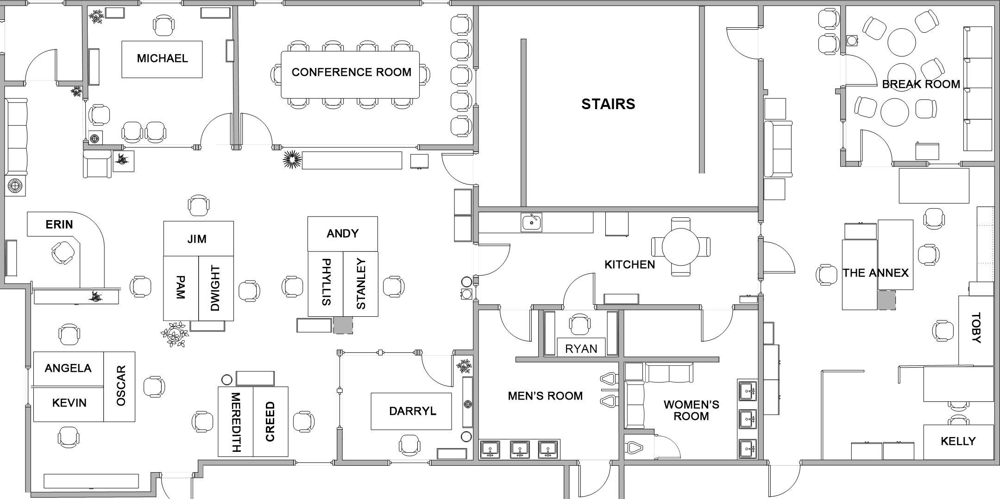
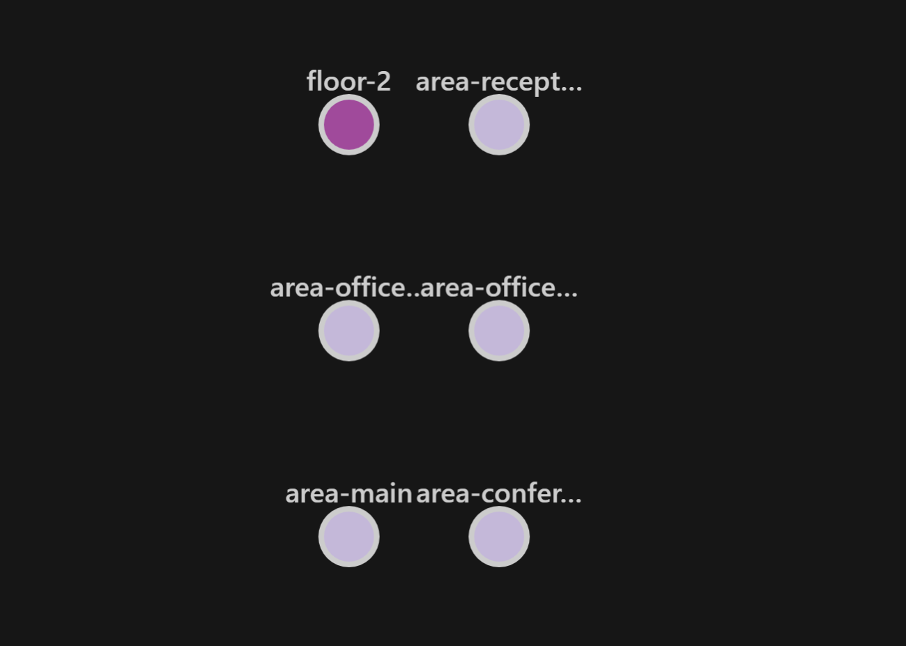
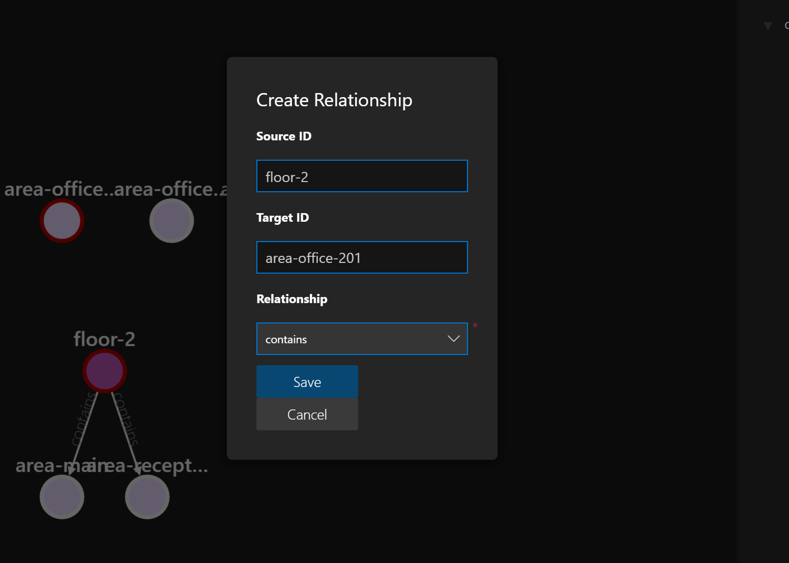
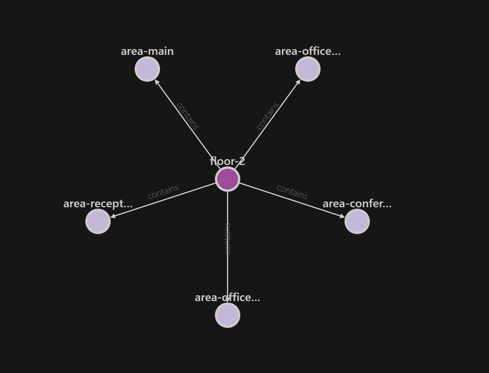
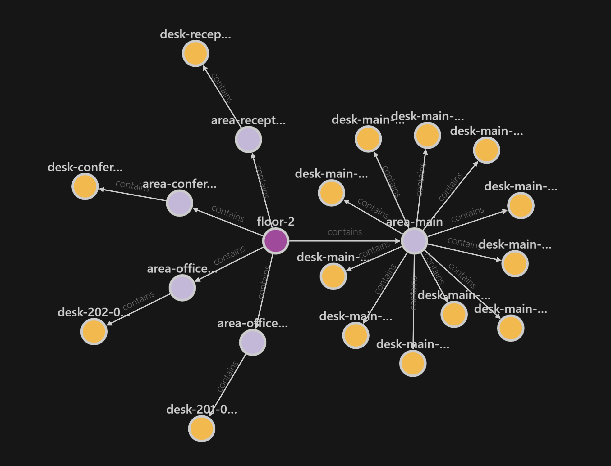
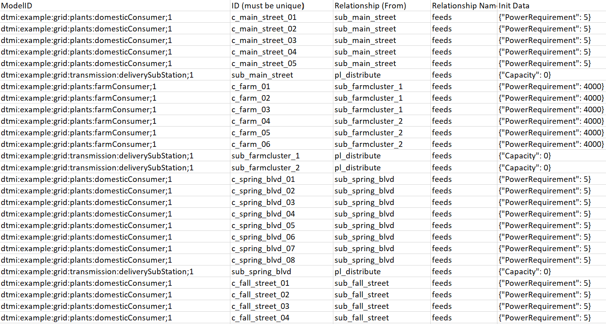
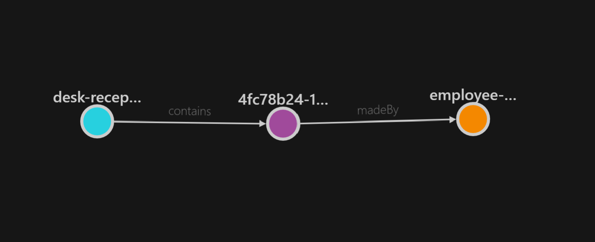

In the first post, I created five models that I'm going to use to create a virtual representation of the physical office. I'm basing the areas on the floorplan I found [online][1]. I'm only interested in the left side of the office because I ended up 3D printing that section. 



I'm going to create the graph using the [Azure Digital Twin Explorer][2] for convenience, for large projects you would automate this process. To start, I'll create the floor, which immediately raised a question. What floor is The Office on? [Reddit][3] to the rescue once more, so we can remain true to the series.
I also created five areas: the two offices; conference room; reception and what I'll call the *main* area. With those area's created, this is what I ended up with:

 

To connect them I can simply select the two entities and add a new relationship. Explorer will automatically populate a list of possible relationships.



After creating the relationships between the areas and the floor, this is what I ended up with:



Adding all the desks and the relationships to the different areas gave me this result:



At this point, I realised that while you can create entities using the Graph Explorer, it doesn't automatically populate enum values. It will create other properties just fine, but enum values are left out. This will give me some issues in the future when trying to update values that don't exist yet. To remediate this, I exported the entire graph and added a `"status": 0,` line to every desk. Importing the graph made certain that the property was now available.

## Import/export
This is also a good moment to explain a little about importing graphs. You are totally free to write your own program for this, but the [Digital Twins Explorer][2] offers two different import features. One is the graph as a JSON file, this JSON file will include all the twins, relationships and models. This is a developer-friendly format, but developers aren't always the people building digital twins. 

Luckily there is a second format that the explorer can work with, and it's an Excel file! The Excel file doesn't describe the models, but it does allow to create twins and relationships. The only downside is that the properties are still a JSON snippet.



Having the entire graph as an export can be used in a lot of ways. It could offer a way of making a backup of your instance, or just as a snapshot of the state at any given moment. It could also be useful to spin up a new ADT instance with the same data, for testing or simulation purposes. I'll probably find some other uses for it someday.

## Back to The Office
After I've added all the employees, it was time to test out if the reservation twin also works. This is the only twin we have right now that has no physical counterpart. This is where business logic creeps into our model, but that's something Microsoft also advertises. ADT can help you model physical environments as well as business processes. I created a reservation manually using the explorer to give Erin a reservation at reception. To validate it exists, I ran the following query:

``` sql
SELECT desk, reservation, employee FROM DIGITALTWINS desk 
JOIN reservation RELATED desk.contains 
JOIN employee RELATED reservation.madeBy 
where desk.$dtId = 'desk-reception-01'
```
Which gave me the following result:



## Next steps
In the next update, I'm going to change the availability of the desks depending on whether a reservation was made.


[1]: https://theoffice.fandom.com/wiki/Dunder_Mifflin_Scranton
[2]: https://github.com/Azure-Samples/digital-twins-explorer
[3]: https://www.reddit.com/r/DunderMifflin/comments/1rmpur/how_many_floors_are_in_the_scranton_office/