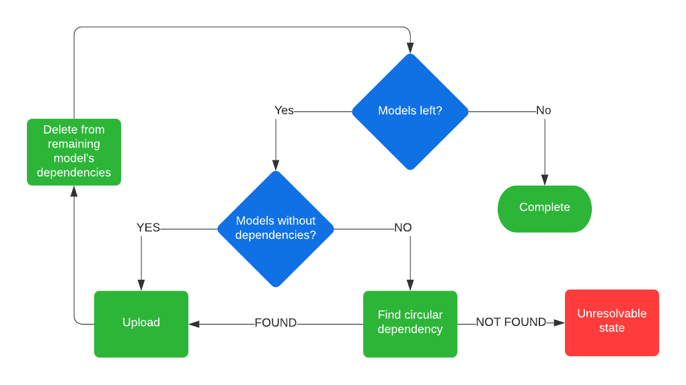

> Update: there is a new and better implementation, and I wrote about it [here](../built-a-worse-model-uploader/).

TLDR: I wrote [some software][5] that does the same thing as [a tool][1] Microsoft made, but in doing so learned a lot about ADT and DTDL. This post describes that journey.

I wrote about Azure Digital Twins (ADT) before, and have played around with some custom ontologies. In reality though, when you start any new ADT project, it's usually better to find an existing standard to work with. This way, you're not reinventing the wheel, plus you're using industry standards, which makes integration with other software a lot easier. Microsoft has created a couple of libraries to get started:
- The RealEstateCore based [opendigitaltwins-building][2]
- An open [Smart Cities ontology][3]
- An [Energy Grid ontology][4] based on the Common Information Model

I've used the RealEstateCore project in many projects now, and only in a few instances do I have to write my own models. It's not strange that it's so complete, it contains 747 different models at this time of writing! This means it's too big to upload in 1 API call, as you can do a maximum of 250 models at a time. And if you think you can just upload them in batches of 250, you'll quickly find out that there are dependencies between the models that you need to take into account. And that's where this project started.

Microsoft has shared [a tool][1] to solve this issue, their model uploader will try to upload all the models it can find one by one, until an exception occurs. This happens when ADT tells you there are dependencies missing. The tool then parses the model for its dependencies and tries to upload those, etc, etc. This is a clever way of solving the dependency problem, because you're using the ADT cloud logic and don't have to write your own. It also means that uploading all 747 models takes **1105** API calls. Given that ADT bills you per million API calls, this is absolutely not a problem, but it did make me wonder if it could be done faster.

> The short version is: you can, but there seems to be an issue that prevents you from being 100% effective.

The idea was simple, parse all the DTDL and for each model find its direct dependencies. To do so, I read the `extends` section and any `components` the interface declares. When you have the list of all the models with their dependencies, you simply find the ones that have none, upload them and then remove the uploaded models from the dependency list of the remaining models. You simply repeat that process until there are no models left.

There are cases where two models have a dependency on each other, which means you're stuck. So when there are no models without dependencies found, I check for 'simple' circular references. Meaning I check if there are two models that depend on only each other. This means there are some cases where the program could still crash if there are more items involved in the circular dependency. But so far, the big three ontologies don't have that issue.

The model uploader will also take into account the service limits of ADT, it will keep its requests under 32KB and a maximum of 250 models at a time. This also means that it's possible that uploading one of the circular references would fail if combined they result in a message that's too large, but that's a problem for another time.

The model uploader can be found on [GitHub][5]. Oh, and as for its performance, it can upload the REC ontology in under 20 API calls, but there's still a [bug][7]. It might be my sloppy code, or a limitation in the API.

[1]:https://github.com/Azure/opendigitaltwins-tools
[2]:https://github.com/Azure/opendigitaltwins-building
[3]:https://github.com/Azure/opendigitaltwins-smartcities
[4]:https://github.com/Azure/opendigitaltwins-energygrid
[5]: https://github.com/MatthijsvdVeer/adt-model-uploader
[6]: https://docs.microsoft.com/en-us/azure/digital-twins/reference-service-limits?WT.mc_id=IoT-MVP-5004034#functional-limits
[7]: https://docs.microsoft.com/en-us/answers/questions/515583/none-of-the-models-in-this-request-could-be-create.html?WT.mc_id=IoT-MVP-5004034
[8]: https://github.com/Azure/opendigitaltwins-tools/tree/master/ADTTools