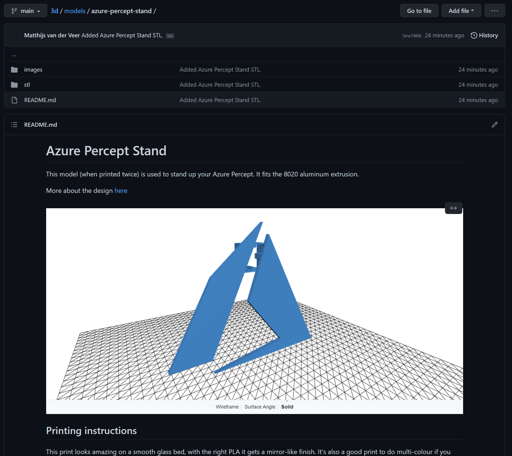

A few months ago, GitHub announced some new features when it comes to Markdown rendering. In [the accouncement][1] they accounce support for geoJSON and topoJSON, and to my delight, STL. I use STLs a lot for 3D printing and this is that little nudge I needed to start storing my own designs in GitHub instead of only having them on Thingiverse. There is just one issue though, to use the new Markdown features you need an ACII STL, but that's not what you'll find online most of the time, we like sharing our STLs in binary!

## How to convert binary STL to ASCII STL
When you download, or even create an STL, chances are that you'll create a binary file. These are compact and make them perfect for sharing. But for Markdown, we need something called ASCII STL. Luckily we can convert between the two, for free! These are the steps I took:
Download [FreeCAD][2]. This free CAD software supports many different formats.

### 1. Import your binary STL
Go to *File > Open* and open your STL. I'm using my Azure Percept Stand as an example:


### 2. Export ASCII STL
To export your model, select it (or hit ctrl-a) and go to *File > Export*. Here you want to select STL as the file type. Note that behind the file type you'll see two file extensions `(*.stl *ast)`. If you save it as an `.stl`, you'll just end up with another binary format. Instead, name your model `<model name>.ast`


### 3. Open the ASCII STL file
When you open your newly created file in a text editor, you can view the ASCII STL definition.
```
solid Mesh
  facet normal -0.000000 1.000000 0.000000
    outer loop
      vertex 15.337000 15.000000 109.000000
      vertex 15.337000 15.000000 139.000000
      vertex 99.000000 15.000000 0.000000
    endloop
  endfacet
  ...
```
Copy and paste this in any place where you can write markdown, make certain to wrap it in a code block like so:
<pre>
```stl
[your ascii stl here]
```
</pre>

Here's just a few examples of what you can do with the new STL Markdown features. I'm sure we'll see some great examples in the community soon!

## Add another dimension to GitHub issues

[Example][3]

## Include a preview in your README files


[Example][4]

[1]: https://github.blog/changelog/2022-03-17-mermaid-topojson-geojson-and-ascii-stl-diagrams-are-now-supported-in-markdown-and-as-files/
[2]: https://www.freecadweb.org/
[3]: https://github.com/MatthijsvdVeer/3d/issues/2
[4]: https://github.com/MatthijsvdVeer/3d/tree/main/models/azure-percept-stand