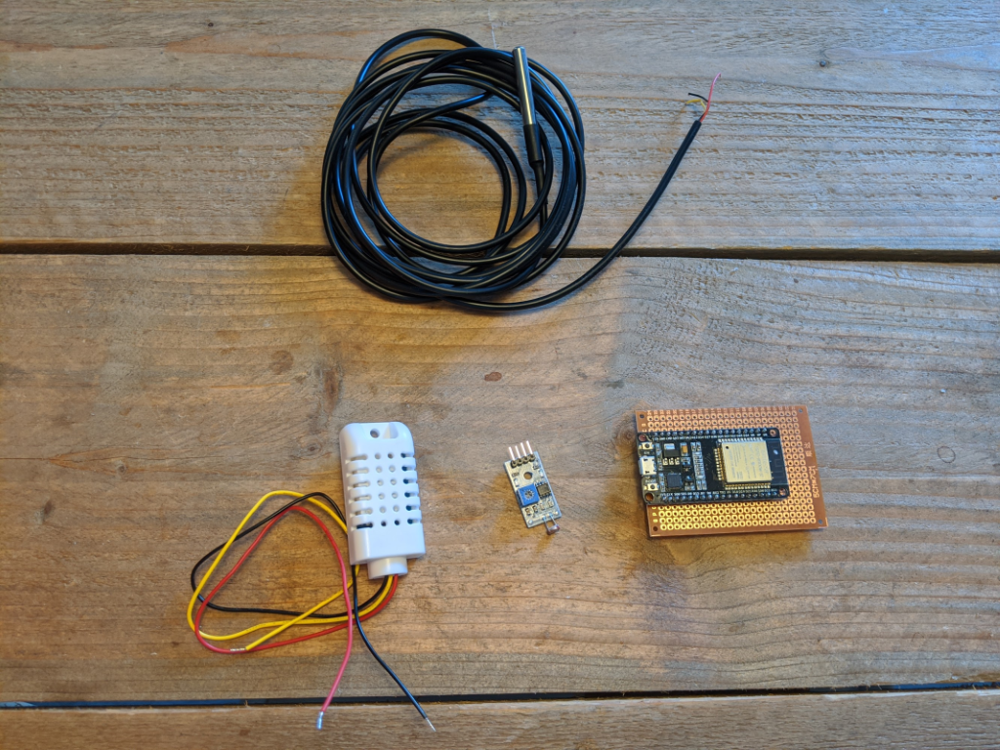
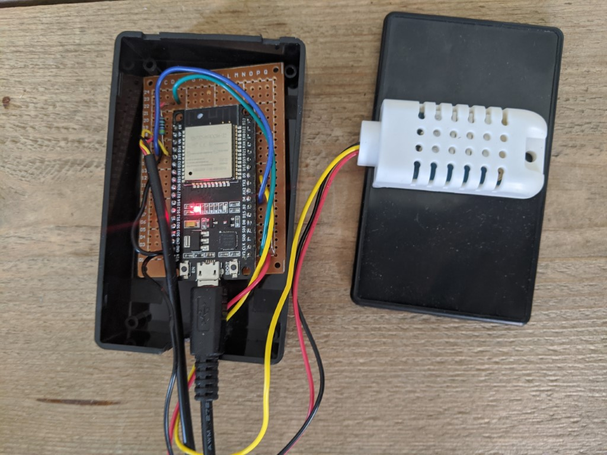
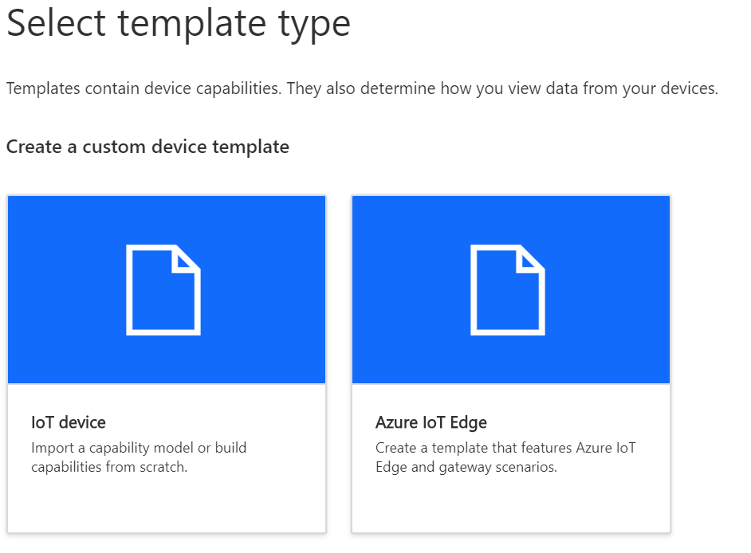
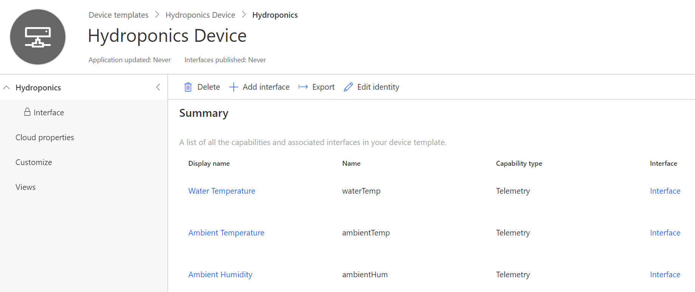
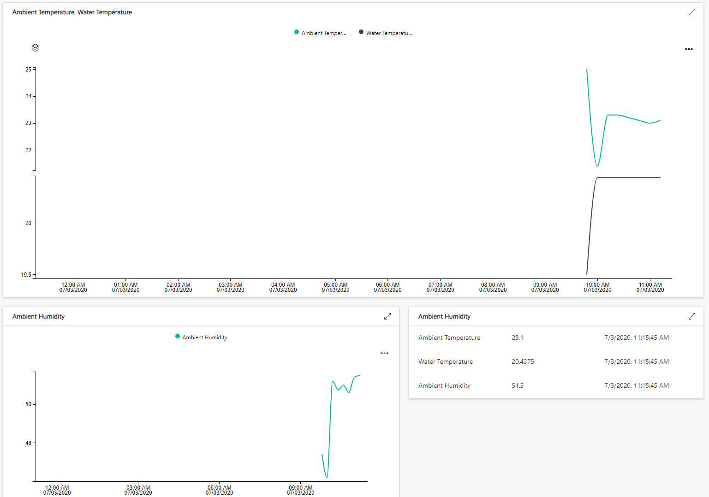
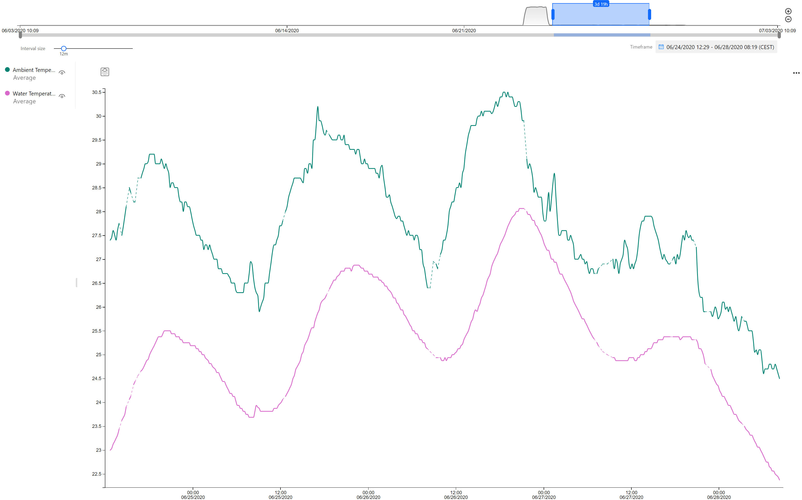

My plants die... a lot

In an attempt to be able to grow something I bought [this little hydroponics set up][4] online. My plan is to grow some chili peppers, because my old ones died. It arrived with all the needed accessories and I plugged it in right away. I don't know what I expected, but a huge wave of dissatisfaction rushed over me. Sure the pump works, but where is my data?! To remedy this lack of insight, I wanted to at least measure a few things so I could blame my apartment's environment in the inevitable event of plant extinction. Also, this month is #JulyOT, so CONNECT EVERYTHING!

## Building the device
If you're like me, you probably have an unlabeled box or boxes filled to the brim with sensors, wires and microcontrollers. If not, here are the parts I'm using:
- ESP32 (ESP8266 works too, with a few changes to the code)
- DHT22 sensor
- DS18B20 sensor (these are sold as just the sensor or with a metal housing and waterproof cable, get the latter one if you don't like sparks)
- 1 10K Ohm and 1 5K Ohm resistor
- Optional: an analogue light sensor like pictured below. I decided not to include it in the end because of where my device is placed (behind the curtains)
- Assorted wires and prototyping board
- An enclosure, because stepping on a microcontroller is the equivalent of stepping on electrified Lego.

I'm not going into detail on how to connect these sensors, because the tutorials for the [DHT22][1] and [DS18B20][2] have been written a hundred times before. Just make sure that you connect the DHT22 to GPIO 4 and DS18B20 to GPIO 5. I like [this writeup][3] of the pinout reference for the ESP32. I started by trying to use GPIO 34 but couldn't get the sensor to work, I still haven't figured out why that's happening. The result is that I jump some cables across the prototyping board to the other side of the microcontroller. Not my finest work, but the extra cables sure do give it a nice aesthetic!

For the code, I started with the [IoT Central Firmware repository][5] that Microsoft provides. It has samples for IoT Central for different devices, including the ESP8266 and ESP32. Now, I'm no embedded developer, my skillset includes Arduino at a basic level. The repository contains an Arduino example for ESP8266, but not for ESP32. So I took the ESP8266 code and changed a couple of things to get it working on the ESP32. You can find my code [on my GitHub][6].

## Connecting to IoT Central
IoT Central is Microsoft's Software as a Service solution for IoT. It offers a quick and easy way to model and provision devices and comes with a few integrations to other platforms. It's the perfect place to get started with smaller IoT projects, and the first 2 devices are free. Microsoft is actively developing new features for this product, so don't be surprised if my screenshots are obsolete before long. All you need to get started is a Microsoft account!

You can create a new application if you follow the steps on [this page][7]. IoT Central is based on devices that have a device template, you can make your own device templates, or import an existing capability model. These models are JSON files written in Microsoft's Digital Twin Definition Language (DTDL) which are at the core of [IoT Plug and Play][8]. Because I already created this device template, you can use [this capability model][9] for your application! To do so, go to Device Templates, add a new one and choose to add an IoT device. Give it a name and hit Create.

On the next screen, you can choose to either create a device template from scratch or to import the capability model I created. After importing the capability model, your device template should look like this:

One of the best features in IoT Central is that you can define custom views per device template. You can go to Views and create a dashboard. Try adding a line graph for the ambient and water temperatures, or a block that just shows the latest values. Once you're done, you can hit Publish in the bar at the top. Your template is now ready to be used.

After that, you can go to devices and add a new device, make sure to select your new template! When you've created the device, navigate to it and hit the Connect button in the top menu. This will show you a screen with the details you need to connect your device to the platform. You can add the Scope ID, Device ID and Primary key to the Arduino code. Also, make sure to enter your WiFi details in the code. If you flash this to your device, it will start sending telemetry (currently at 10 minutes interval) to your IoT Central instance. After a minute or so, you'll notice the dashboards will contain some data!

I had my device up and running just before one of the hottest weeks this year, I wonder if I'm going to grow anything in water that goes up to 28 degrees Celsius...

## What's next?
There we go, data! While this will not make my plants die any less, at least I'm satisfied to make this device a little smarter. In the next project, I might add a relay to the pump so I can start and stop it from IoT Central. Now that I'm thinking about it, that might also be a good way to automate the starting and stopping based on a schedule! To be continued...

[1]: https://randomnerdtutorials.com/esp32-dht11-dht22-temperature-humidity-sensor-arduino-ide/
[2]: https://arduinogetstarted.com/tutorials/arduino-temperature-sensor
[3]: https://randomnerdtutorials.com/esp32-pinout-reference-gpios/
[4]: https://www.aliexpress.com/item/32826785497.html
[5]: https://github.com/Azure/iot-central-firmware
[6]: https://github.com/MatthijsvdVeer/iot-central-hydroponics
[7]: https://docs.microsoft.com/en-us/azure/iot-central/core/quick-deploy-iot-central?WT.mc_id=IoT-MVP-5004034
[8]: https://docs.microsoft.com/en-us/azure/iot-pnp/overview-iot-plug-and-play?WT.mc_id=IoT-MVP-5004034
[9]: https://raw.githubusercontent.com/MatthijsvdVeer/iot-central-hydroponics/master/Hydroponics.json