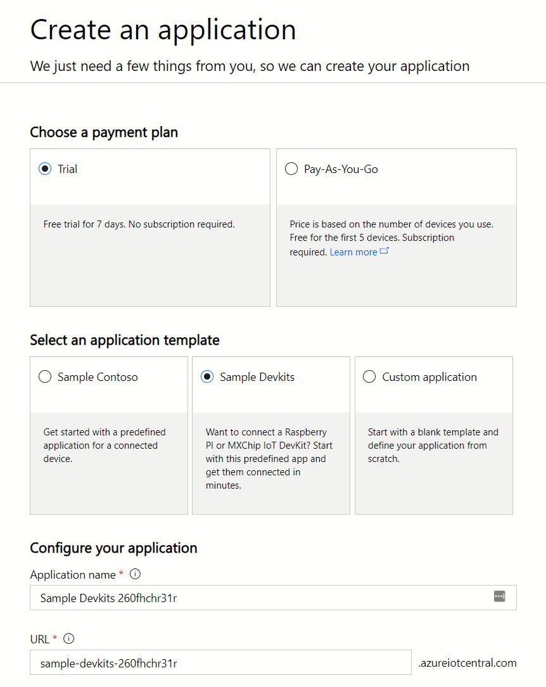

Note: I migrated this post from my old blog, some pictures were lost because of general clumsiness.

Node-Red is by far my favorite way of prototyping, whether it is on a desktop, tablet or Raspberry. In many proof of concept projects I prefer Node-Red to fill in the gaps that would take longer to code. It runs brilliantly on a Raspberry Pi and has access to the GPIO ports built in! In this post I will show you how to connect Node-Red on a Pi to connect to Azure IoT Central.

Azure IoT Central is a very convenient layer on top of Azure’s IoT Hub. If you’ve ever tried the excellent [Azure IoT boot camp](https://docs.microsoft.com/en-us/learn/browse/?products=azure-iot) you’ll see that Central comes with a lot of things out of the box that you’ve built before. IoT Central is a very quick way of starting a new IoT project. It takes care of device registration, monitoring, security and more. You can find all the documentation [here](https://docs.microsoft.com/en-us/azure/iot-central/). In this first post we will set up IoT Central, in the next post we will connect the Raspberry Pi.

For this series you need a Raspberry Pi set up with Raspbian and [Node-Red installed](https://nodered.org/docs/getting-started/raspberrypi). You don't need an Azure subscription if you are using the free tier of IoT Central, but your project will only run for seven days. For this example we are going to report temperature and humidity values from a DHT11 sensor, but you can report anything you want! Use whatever sensor you have lying around. I personally use the [CrowPi prototyping kit](https://www.kickstarter.com/projects/elecrow/crowpi-lead-you-go-from-zero-to-hero-with-raspberr), it comes with a ton of sensors built in, plug and play baby! Lets begin!

## Create a new IoT Central Application
Go to the [IoT Central page](https://apps.azureiotcentral.com/build) and create a new app. Below are the settings I used. You can use either the free version or opt for a pay-as-you-go application. We choose for a “Sample Devkits” application, which comes with some initial setup already done. Hit create again and let Azure work its magic, this will take a few minutes.

## Create a new Device Template
When Azure has created your new IoT Central, visit the URL you entered before. It should look like https://{the-name-you-entered}.azureiotcentral.com. We want to start by creating a Device Template. This template describes a device, of which you can have multiple instances. A template defines the metrics a device can report, as well as settings, rules and commands for that device. On your newly created homepage, hit the “Create Device Template” block.

I’ll name my template CrowPi, because that’s the kit I’m using. On the next screen click the “Edit Template” button. Now we are going to add two measurements, start by clicking the New Measurement button and choose Telemetry. We will perform this step twice with the values in the picture below.

The minimum and maximum values aren’t boundaries, but are simply for the charts to show meaningful data. I have no intention to turn my office into a sauna, but the humidity value can now show between 0% and 100% humidity. Hit the “Done” button, you have successfully created a new template! While you created your template, IoT Central also created a simulated device. This fake device can be useful to test your applications with.

In the next post, we will connect a real device to IoT Central.