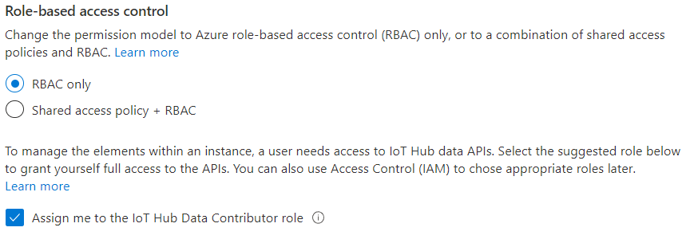
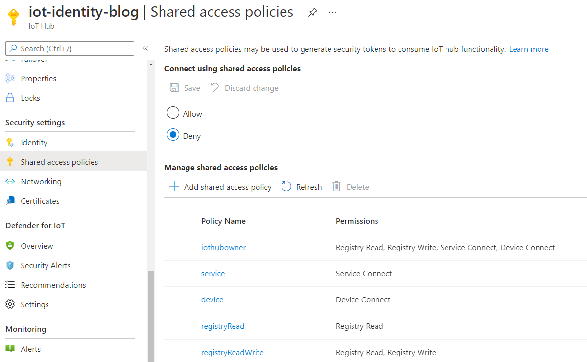
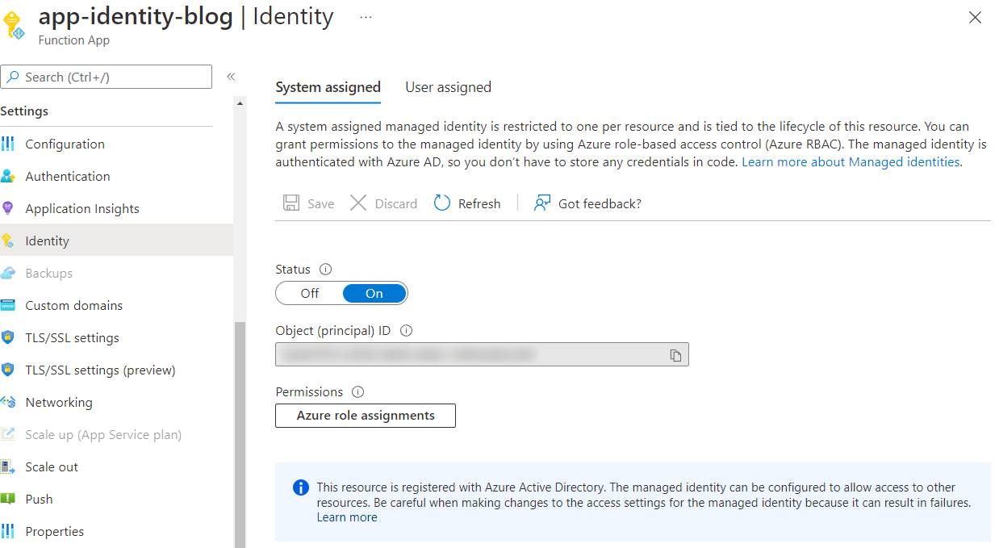
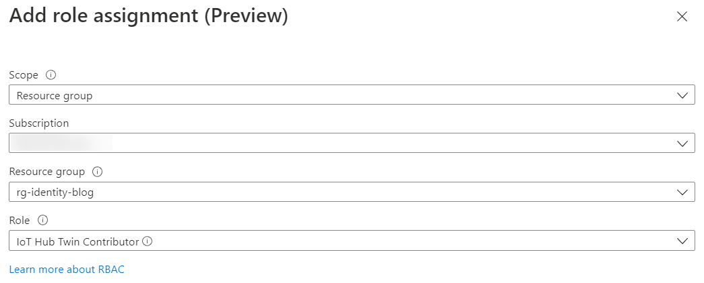

IoT Hub offers a way to connect to its Service control plane by using Role-Based Access Control (RBAC). On top of that, you can completely disable access for shared access policies, which used to be the only way to connect to this plane. There are 4 built-in roles that Azure provides you with (excerpt from [Microsoft Documentation][1])
|Role|Description|
|---|---|
|IoT Hub Data Contributor|Allows full access to IoT Hub data plane operations.|
|IoT Hub Data Reader|Allows full read access to IoT Hub data plane properties.|
|IoT Hub Registry Contributor|Allows full access to the IoT Hub device registry.|
|IoT Hub Twin Contributor|Allows read and write access to all IoT Hub device and module twins.|

You can also create custom roles to be specific about what an application can do with your IoT Hub.

Because I wanted to test out the RBAC features, I decided to disable the shared access policies, and find out what it takes to have an Azure Function connect to IoT Hub with a system-assigned managed identity.

## Creating the Hub
You start by creating an IoT Hub in the Azure portal. We can choose for *RBAC only* and disable shared access policies in this step. You can also check the box to assign the IoT Hub Data Contributor role for yourself. Setting it now is helpful during development as well; more on that later.



When the deployment is complete, you can go to the shared access policies blade and verify that the policies are disabled.


## Creating an Azure Function
You can create a system-assigned identity for any Function, I decided to make a new Function on a consumption plan, but you also use one hosted on an App Service Plan of your choosing. When you've created the Azure Function, go to the Identity blade and switch on the system-assigned identity. 



## Assigning access
While your looking at this newly created Function identity, go ahead and click the *Azure role assignments* button. You can add a role assignment by clicking on the *Add role assignment* button. Select *Resource group* for the scope, and give the Function the *IoT Hub Data Contributor* role.



**Note:** We just gave the Function access to any IoT Hub in this resource group. You can also choose to assign this role on a specific IoT Hub instead. I prefer limiting the scope of a role assignment to the bare minimum over having them all conveniently on the resource group level. To keep this tutorial nice and short, I'm taking the easier path of assigning it through the flow described above.

## To the code!
With our cloud infrastructure now in place and configured, it's time to write some code to use the system-assigned identity to contact the IoT Hub. We're going to create an HTTP triggered Function that returns the amount of devices in the registry. Create a new Functions project with an HTTP triggered Function, and set it up for [dependency injection][2]. While this step has no impact on using a managed identity, I like to inject a fully configured ServiceClient into my Function to use. When that's done, install the [Azure.Identity][3] NuGet package and the [Microsoft.Azure.Devices][4] package.

To use the managed identity of the Azure Function, we will use the `DefaultAzureCredential`. This might seem counter-intuitive when there is also a `ManagedIdentityCredential` available (and you can definitely use that instead). I'm using the `DefaultAzureCredential` instead, because it will allow me to authenticate with my local credentials when I'm developing. I want to avoid any `#IF DEBUG` or other extra logic for local development. The `DefaultAzureCredential` can try several ways of authenticating, depending on the variables available during runtime. We'll use this to authenticate with our Microsoft account in a [later step](#Development). To inject a fresh RegistryManager into your function, you can wire it up in your dependency injection config. And yes, that's a hard-coded host name there, you can move that to your application config!

#### Startup.cs
```cs
public sealed class Startup : FunctionsStartup
{
    public override void Configure(IFunctionsHostBuilder builder)
    {
        const string hostName = "iot-identity-blog.azure-devices.net";
        _ = builder.Services.AddScoped(provider =>
        {
            TokenCredential tokenCredential = new DefaultAzureCredential();
            return RegistryManager.Create(hostName, tokenCredential);
        });
    }
}
```

The code to count the number of devices in your IoT Hub:

#### CountFunction.cs
```cs
public sealed class CountFunction
{
    private readonly RegistryManager registryManager;

    public CountFunction(RegistryManager registryManager) => this.registryManager = registryManager;

    [FunctionName("Count")]
    public async Task<IActionResult> Run([HttpTrigger(AuthorizationLevel.Anonymous, "get")] HttpRequest req)
    {
        var query = this.registryManager.CreateQuery("SELECT COUNT() as totalNumberOfDevices FROM devices", 1);
        var results = await query.GetNextAsJsonAsync();
        return new OkObjectResult(results.Single());
    }
}
```

Go ahead and deploy your Azure Function. You can also take this time to add a device to your IoT Hub. When you send a GET request to the endpoint of your newly created Function, the result should be:
```json
{
  "totalNumberOfDevices": 1
}
```

## <a name="Development"></a>What about development?
When you're developing this Azure Function, chances are you want to debug your code against the same IoT Hub. You gave yourself the *IoT Hub Data Contributor* role when you created the hub. To authenticate with the hub as yourself while debugging, go to *Tools -> Options -> Azure Service Authentication* and select the account you used to create the IoT Hub. You will run the Azure Function under your account when you start debugging. Convenient!

## Conclusion
Configuring RBAC for your IoT Hub is easy. Using a managed identity to connect to your Hub can be done through the SDK. I prefer RBAC for connecting to my IoT Hub over access policies. It can be hard to track which application has access to a policy, and whoever has the policy key can connect to your hub. RBAC is easier to follow, especially in the case of system-assigned identities. You can also be certain that the identity is cleaned up when the connecting resource stops existing.

## Stop clicking in the portal, Matt!
After a long day of writing infrastructure as code, I like clicking through the portal and writing these blog posts. But if you want to disable shared access policies in Bicep, you can set the `disableLocalAuth` property to `true`:
```
resource iotHub 'Microsoft.Devices/IotHubs@2021-07-01' = {
  name: 'iot-${appName}-${uniqueString(resourceGroup().id)}'
  location: resourceGroup().location
  sku: {
    capacity: 1
    name: 'S1'
  }
  properties: {
    disableLocalAuth: true
  }
}
```

And enabling a system-assigned identity for your Function is easy as:
```
resource functionApp 'Microsoft.Web/sites@2020-06-01' = {
  name: functionFullName
  location: resourceGroup().location
  kind: 'functionapp'
  identity: {
    type: 'SystemAssigned'
  }
}
```

  [1]: https://docs.microsoft.com/en-us/azure/iot-hub/iot-hub-dev-guide-azure-ad-rbac?WT.mc_id=IoT-MVP-5004034#manage-access-to-iot-hub-by-using-azure-rbac-role-assignment
  [2]: https://docs.microsoft.com/en-us/azure/azure-functions/functions-dotnet-dependency-injection?WT.mc_id=IoT-MVP-5004034
  [3]: https://github.com/Azure/azure-sdk-for-net/blob/Azure.Identity_1.5.0/sdk/identity/Azure.Identity/README.md
  [4]: https://github.com/Azure/azure-iot-sdk-csharp