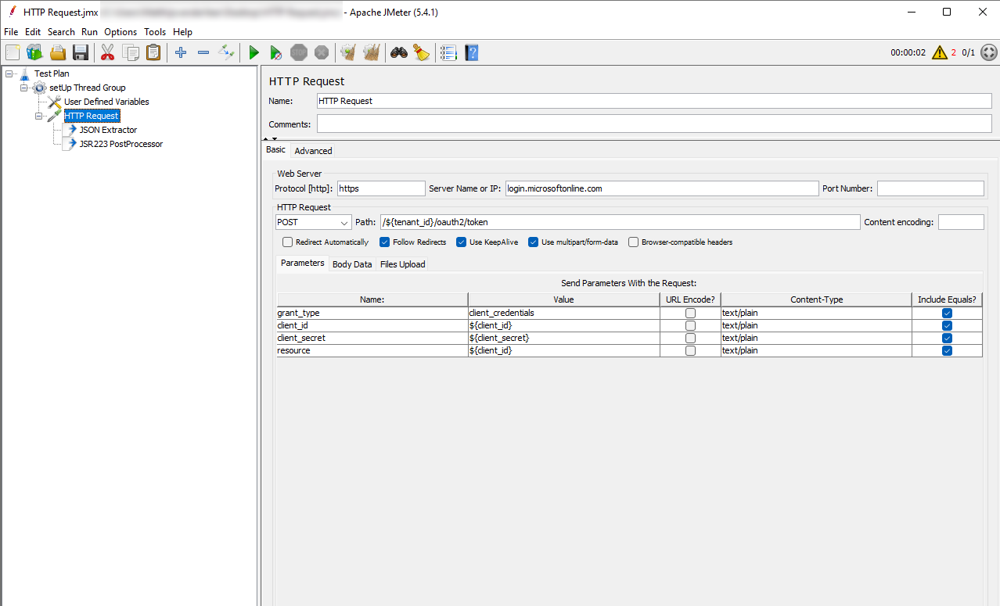

If you have to load test an application with JMeter, but the application requires Azure AD authentication without the option for a user to supply a username and password, you have to get creative. Many examples show importing CSV files with username and password combinations, but I needed something different. This post describes the steps I took, it doesn't use any of the plugins available on the web, but instead only uses the default components of JMeter. 

> I'm starting of with creating a new App Service, so you can follow along if you don't have anything set up yet! If you just want to get to the authenticating part, [skip ahead](#SettingUpJmeter)

## Create a new Azure App Service
In the Azure Portal, search for App Services and create a new one. Make sure you have a unique site name. A B1 App Service Plan is enough for this test. We're not deploying any code to this site, you can leave all the other settings to their defaults.


## Enable authentication
After the deployment is complete, visit your newly created page in the Azure Portal. Right now it's accessible to everyone! Let's change that by enabling authentication, the "Easy Auth" way.
In the Settings list, select Authentication to open the Authentication blade. Hit the button "Add identity provider".


Select "Microsoft" as your identity provider, and leave all settings default. This will create an app registration in Azure AD that we will later use to authenticate with.


## Get a client ID and secret
To authenticate with JMeter, we will need 3 different keys. To get these, search for Azure Active Directory in the portal and go to Azure AD. Click on the App Registrations link on the left, under "Manage". This will show a list of app registrations, select the one you just created. You can copy the Directory (tenant) ID and Application (client) ID. Afterwards, click on "Certificates & secrets".


If you've followed along, you should already see 1 secret. But we're going to add our own, click on "New client secret" and enter a description of your choosing.


Copy the secret Value (do it now, you won't see it later).


## <a name="SettingUpJmeter"></a>Setting up JMeter
Download [JMeter][1] and open it. If you're on windows, run the /bin/jmeter.bat file to get started. What I want to achieve is to authenticate with Azure AD only once, before running any other tests. So I'm creating a **setUp Thread Group** that will run at the start of our test.


In this thread group, we'll create a User Defined Variables component and enter the following keys and values:
|key|value|
|---|---|
|tenant_id|**the tenant ID you copied**|
|client_id|**the application ID you copied**|
|client_secret|**the secret value you copied**|


This will make the variables accessible within this thread group, no need to share them with the rest of the JMeter test! Under the Thread Group, we will add an HTTP Request. Under that request, put two post-processors:
- JSON Extractor
- JSR223 PostProcessor

We will use these post-processors to pull our fresh access token from the HTTP Request and map it to a JMeter property. Properties are globally available and not bound to a scope like variables are. Your test setup will look like this now:


## Authenticating with JMeter
To do the actual authentication, we will need to set up our HTTP Request. Set the protocol to `https`, set the server name to `login.microsoftonline.com`, change the request to a `POST` method and enter the following path: `/${tenant_id}/oauth2/token`. If you're unfamiliar with JMeter, the `${tenant_id}` notation means we're referencing a variable. Make sure to select **Use multipart/form-data**. Finally, add the following parameters:

|name|value|
|---|---|
|client_id|${client_id}|
|client_secret|${client_secret}|
|resource|${client_id}|
|grant_type|client_credentials|



Almost there, in the JSON Extractor, enter the following:
|field|value|
|---|---|
|Names of created variables|access_token|
|JSON Path expressions|$.access_token|
|Match No.|0|
|Default Values|ERROR|

This will tell the post-processor to retrieve the `access_token` field from the JSON and create a variable with the same name. We will turn that into a property by entering the following script in the JSR223 PostProcessor:
```
props.put("access_token", "${access_token}");
```

Let's see if this works! Add a **View Results Tree** listener to the Test Plan (the root level). And start the test. If you click on the listener, you should see a successful request, and clicking on it should reveal the access_token in the response.


## Sampling the web page
With all this in place, add a new Thread Group (not a setUp one this time). Under that group, create an **HTTP Header Manager** and an **HTTP Request** component. We will use the former to set the HTTP Headers for all our HTTP Requests. So in the HTTP Manager, add the following header:
|field|value|
|---|---|
|Authorization|Bearer ${__property(access_token)}|

The `${__property(access_token)}` tells JMeter to find a property with that name. Note that `__property` has two underscores!

Next, edit the HTTP Request component you just added. Use `https` for the protocol again, and add `<your site here>.azurewebsites.net` as the server name.


With all of this set up, run the test again and see the output of the View Results Tree!


## Conclusion
For simple client credentials authentication, you don't need any plugins. You can set up your test in a way that 

The next step you should take if you're running this in an automated fashion, is replacing the user defined variables with parameters. You don't want to keep the secrets in that file for the whole ~~world~~ team to see. I hope this post helps someone else set up their test a bit faster than it took me. I'm specifically avoiding plugins in the hope that this `jmx` file will remain compatible with [Azure Load Testing][2], which is in preview at the time of writing.

  [1]: https://jmeter.apache.org/download_jmeter.cgi
  [2]: https://docs.microsoft.com/en-us/azure/load-testing/overview-what-is-azure-load-testing?WT.mc_id=IoT-MVP-5004034