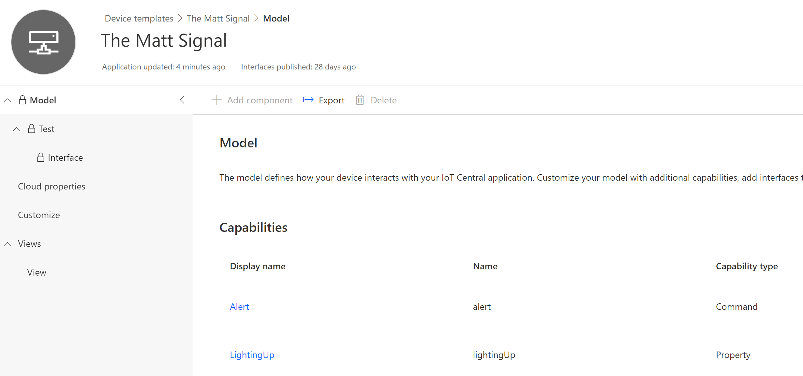
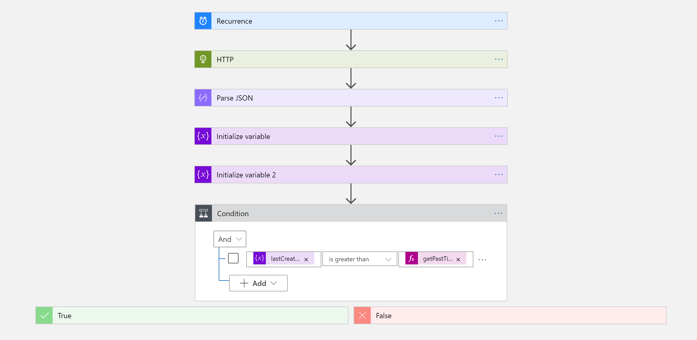
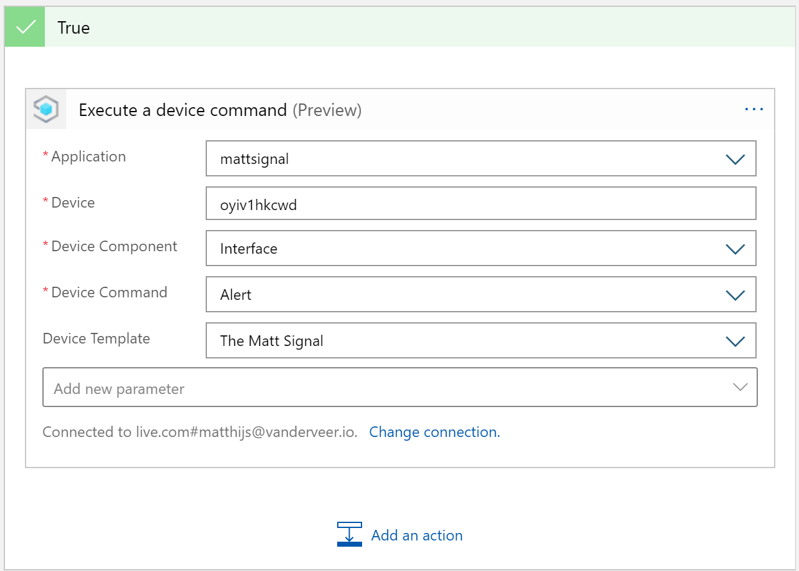
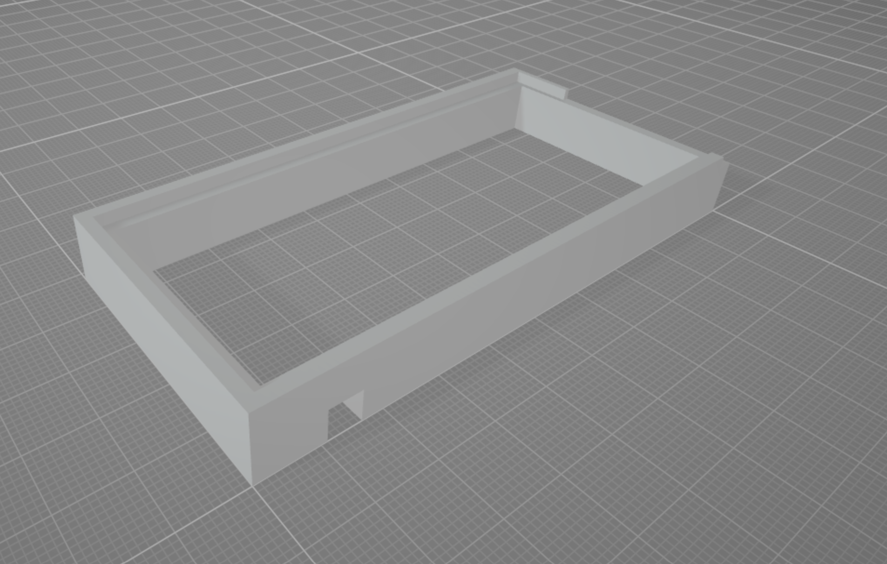

Early November I got the amazing news that I received the Microsoft Most Valuable Professional (MVP) award! With it come a lot of benefits, but without a doubt, the most iconic one is the little glass award that you get. But if anything is going to take up space on my desk, it better be useful! So to celebrate the award, I decided to 'IoT' it (yes, using it as a verb). And what better way to celebrate my IoT MVP-ship than to strap some flashing LEDs to the award! A device blinking an LED is basically the "Hello World" of IoT.


## Useful, how?
My goal is to make the "Matt Signal" light up every time there is a new StackOverflow question in the tags that I follow. During the day, the blinking is actually subtle enough so it's not too distracting. I immediately set out to write some code, but then decided to challenge myself and build the project without writing any code. This post contains a description of all the components I used, it's not a tutorial, but I'll link to other tutorials and docs for more context! The different components I used:
- IoT Central, Microsoft's software as a service IoT platform
- Azure Logic Apps, a no/low-code approach to building integrations
- StackExchange API, to retrieve the questions
- Node-Red on a Raspberry Pi, because this is the absolute fastest way to prototype anything

## IoT Central
The first thing I did was [create a new IoT Central app][1] so I could start describing the capabilities of my device. At this point I didn't install or configure the actual device yet, I like creating the device template first. It helps me choose between the different ways a device can communicate with IoT Central. I decided on using a Command to tell the device to start blinking, and a Property to allow the device to tell us whether or not it's already flashing. You could also use a Writeable Property instead and lose the command, it would allow you to set the requested state (e.g. blinking/off) and the device to confirm it. You can find more info on the different options [here][2]. I also went ahead and created a new instance of this device, I'll need it later.



## StackExchange API
StackOverflow is part of StackExchange, and so if we want to retrieve new questions, we have to use the [StackExchange API][3]. You can register for an app key and use it to call the API. There are two ways of achieving what I want:
- Use the [Questions API][4] and filter it on the tag we need
- Use the [Questions/unanswered/my-tags API][5] and retrieve all the questions for *my* tags specifically

I couldn't find a way to leverage the first endpoint and make it return questions for all the tags I'm interested in, so I took the second endpoint instead. If you do the same, you'll need to create an access_token, you can do that by following the steps for the implicit OAuth 2.0 flow on [this site][6]. Do I need to mention you wouldn't do this in production? 😀 The URL I ended up calling is this:
```
https://api.stackexchange.com/2.2/questions/unanswered/my-tags?order=desc&sort=creation&site=stackoverflow&access_token=<much secret>
```

## Logic App
Ok, now let's get that cloud working for us. You need to [create a Logic App][7] on your Azure subscription. Logic Apps are covered by a free Azure subscription, so go ahead and make one if you don't have it. My Logic App is going to run on a timer, check for new questions and call IoT Central when there is a new question. I don't have to know when the app ran last time, I can just check if the newest question is younger than 15 minutes, because 15 minutes is my timer recurrence!



The steps are pretty simple, I call the StackExchange API using the HTTP node and parse the JSON. You can call the API in Postman and use the response to generate the schema for your Parse JSON step.

In the next two steps I initialize two variable, one to retrieve the last question creation datetime, and a second to convert it into a timestamp. I'm doing this because the API returns the datetime as a Unix Epoch timestamp, but we need to compare it to the current time, which is a String in Logic Apps. To initialize the first variable I used `first(body('Parse_JSON')?['items'])?['creation_date']` as an expression. To convert it to a String timestamp I used `addToTime('1970-01-01', variables('lastQuestionCreation'), 'second')` in the second Initialize Variable node.

Now that I have the exact time the last question was asked, I can use that in a condition block to see if it's greater than `getPastTime(15, 'minute')` (15 minutes ago), if that's true we get to our last node: IoT Central: Execute a device command.



When you configure this node, you'll point it to your IoT Central app, choose the right template, device and command, and you're good to go!

## The Hardware
I opened most of the many boxes of "IoT stuff" that I really should start labeling until I found the LED box. In it was a bag of bright 2-pin RGB LEDs. Huh? I remembered ordering them a long time ago, these LEDs flash... violently in many different colors when you apply some current to it. You can't control the colors, they just do their thing. Perfect for our quick no-code needs! I soldered them onto a little prototype board with some resistors so they would cover the biggest part of the base. There are two wires attached to the board, one to be connected to ground, the other to a GPIO pin we can drive. I chose pin 7.

")

I used calipers to accurately measure the dimensions of the award, and it **only** took three tries to design a little base that I could 3D print. The LEDs sit in the base, and it allows the award to be on top of it.



## The software
So far so good, no code written. My Logic App is telling IoT Central when the device should start frantically flashing lights. Now I just need to configure the device. I grabbed whatever Raspberry Pi was closest and installed the latest Raspberry OS, [installed Node-Red][9] (and run it as a service) and started configuring the flow. There are many ways to connect Node-Red to IoT Central or Hub, but the best node I've found so far is [this one][10]. It's a single node for every operation! It handles commands (direct methods) and properties all from the same node. That makes the flow a bit messy because the command originates from the output of the node, and the response needs to go back to the input. But I ended up with this:


> Hey, those are Function blocks! You said no code!

I used Function blocks there to set the payload of the message, you can do the same with a Template node, here's an example:
```js
return {
    topic: 'response',
    requestId: msg.payload.requestId,
    methodName: 'alert',
    status: 200,
    payload: {}
}
```

So that's it, my little glass award now lights up every time there is a new IoT-related question!


[1]:https://docs.microsoft.com/en-us/azure/iot-central/core/quick-deploy-iot-central?WT.mc_id=IoT-MVP-5004034
[2]:https://docs.microsoft.com/en-gb/azure/iot-central/core/howto-set-up-template?WT.mc_id=IoT-MVP-5004034#properties
[3]:https://api.stackexchange.com/
[4]:https://api.stackexchange.com/docs/questions
[5]:https://api.stackexchange.com/docs/unanswered-questions-my-tags
[6]:https://api.stackexchange.com/docs/authentication
[7]:https://docs.microsoft.com/en-us/azure/logic-apps/quickstart-create-first-logic-app-workflow?WT.mc_id=IoT-MVP-5004034
[8]:https://www.aliexpress.com/item/32280310015.html?spm=a2g0s.12269583.0.0.23b81262aSl0Vc
[9]:https://nodered.org/docs/getting-started/raspberrypi
[10]:https://flows.nodered.org/node/node-red-contrib-azure-iot-device