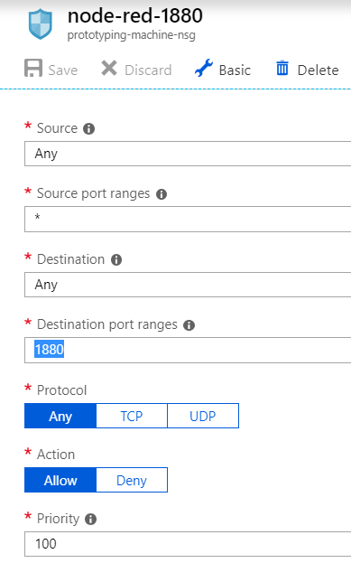
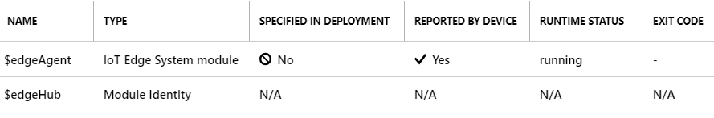
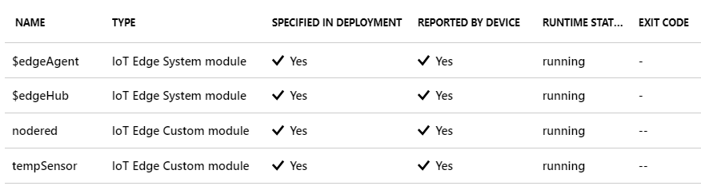
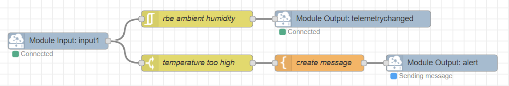

I think prototyping is the best part of my job.

Prototyping isn’t just a fancy word for “seeing what works”, it’s a way of producing working software/products with minimal effort. It allows the most technical of people to show a client or friend exactly what’s possible with modern technology. It shouldn’t surprise you that I got very excited when I found out the fastest way to start prototyping on Azure IoT Edge.

[Azure IoT Edge][1] is Microsoft’s latest effort to push their cloud offering to the “edge” of your IoT network. This means that you can push your AI models, steam analytics and even Azure Functions to devices that would normally only serve up telemetry. This opens up a plethora of new possibilities for reducing cost and latency, and deploying field gateways. But it also opens up new possibilities to build prototypes with your devices.

All this functionality is pushed to your device as a “module”. A module is nothing more than a Docker container, this means you can start bringing all your favourite containers to the edge now! In this episode of the [Internet of Things Show][2], Greg Manyak and Olivier Bloch present a super-fast way of testing out your edge modules in Azure. As it happens, my favourite prototyping tool (Node-RED) is deployable in a Docker container, and an IoT Edge Module version of it is available [here][3]. In this post I’ll show you how to tie the two together to enabled ultra-fast prototyping for edge devices. We will cover routing between modules and working with the Module Twins.

## Creating Your Virtual Machine
Don’t you worry, if you start now, you will have a VM running IoT Edge in exactly **three minutes**. This preconfigured VM can be created on a Standard B1ms machine (a tiny machine that will cost you 15 euro per month). After you’ve created your machine you only need to open up port 1880, this is so we can hook up prototypes in Node-Red. By default, all device communication is outbound-only by design, because your devices should never accept inbound traffic.

## Create An IoT Hub And Edge Device
While your VM is provisioning you can go ahead and create an IoT Hub, this will cost you another **three minutes** of your time and the best news is that you won’t need to delete it afterwards, you can have one free hub per subscription! If you already have a free hub configured and need a new one, make sure to create an **S1 tier** hub, because a basic tier hub doesn’t support Edge devices.

When your hub is created, create a new Edge device. Find the **IoT Edge** link on the left side and hit **Add an IoT Edge Device** on the top of the page. All you need to enter is a name for the device. When the device has been created, click on it and copy the primary connection string to your clipboard.

## Configure Your VM To Connect To The Hub
You don’t need to be an Ubuntu specialist to configure this VM to connect to our hub. Go to your VM in the Azure Portal and find the **Run Command** link on the left. Choose RunShellScript and then run the following command:

    /etc/iotedge/configedge.sh "<your_iothub_edge_connection_string>" 

After this, go back to the device details in the IoT Hub, you should see that the $edgeAgent is reported by the device! This means that your VM has successfully deployed the Edge Agent. If you don’t see this result right away, give it a minute or two. We can start deploying our own modules now.

## Adding Modules And Routing
Go back to our IoT hub and go to the device details of our device. Normally we would create a device deployment that targets all devices of this type, but for the purpose of this tutorial we will add modules directly to the device. Click on **Set modules** in the top of the screen and add two modules in the **Deployment Modules** section. In this tutorial we’ll include the infamous Simulated Temperature Sensor, so we can work with the sensor data. Add a module and use **tempSensor** as the name and **mcr.microsoft.com/azureiotedge-simulated-temperature-sensor:1.0** as the image URI. Leave the other fields as default.

For the second module, use **nodered** as the name and **gbbiotwesouth/noderededgemodule:0.6.0-amd64** as the image URI. Also use the following data in the **Container Create Options:**
    
    {
        "HostConfig": {
            "Privileged": true,
            "PortBindings": {
            "1880/tcp": [
                {
                "HostPort": "1880"
                }
            ]
            }
        }
    }

If you want to use Module Twin properties, this is an excellent moment to provide some. They work a lot like device twin properties, but are scoped to just this module. I’ll skip this field for now, but at the end of this tutorial you’ll find nodes that receive and send module twins, so don’t be afraid to use these in your prototypes.

When you hit next, you’ll see the **Specify Routes** screen. In this step you will configure where your messages go. The configuration we will use has two routes. **sensorToNodered** sends the simulated sensor data to the Node RED module, it will use an input called **input1**. The **noderedToHub** route sends the output from Node RED to the IoT HUB.

    {
        "routes": {
            "sensorToNodered ": "FROM /messages/modules/tempsensor/outputs/* INTO BrokeredEndpoint(\"/modules/nodered/inputs/input1\")",
            "noderedToHub ": "FROM /messages/modules/nodered/outputs/* INTO $upstream"
        }
    }

Click next and hit Submit, we will have to wait a few minutes until the modules are deployed on the device, hit refresh until you see the new modules are reported by the device.

That’s all there is to it! If you browse to **http://<your.vm.ip>:1880** you should be presented with an empty Node RED screen. On the very bottom of your palette you’ll find the Azure IoT Edge nodes you need to build your flow with. You will need no configuration to connect to IoT Hub, this is provided by the module we’re running in.

## Happy Prototyping!
In this post you’ve seen how fast you can create a prototyping environment in the cloud. You could also do this on a Raspberry Pi and use that as a physical device with actual sensors and data.

I keep showing Node RED to people because the possibilities are endless with this tool. So I’ll give just a small example of how easy it is to manipulate some input. In the picture below I constructed a flow that will send telemetry only when the ambient temperature changes. It will also send alerts when the machine temperature is too high.

Thanks for reading! Feel free to contact me with questions. Big thanks to everyone at [The Internet Of Things Show][2] and the author of the Node RED nodesfeatured in this post.

If you are looking to do this on a Raspberry Pi and want to use the GPIO headers, you can use the following image as your container: **matthijsvdveer/noderededgemodule:0.1.0-arm32v7-rpi** It is based on the image in this post, but has the GPIO headers enabled. It is currently on [Github as a pull request][4].

[1]: https://azure.microsoft.com/en-us/services/iot-edge/
[2]: https://channel9.msdn.com/Shows/Internet-of-Things-Show/Azure-IoT-Edge-VM-on-Azure-Marketplace
[3]: https://flows.nodered.org/node/node-red-contrib-azure-iot-edge
[4]: https://github.com/gbbiotwesouth/noderededgemodule/pull/1